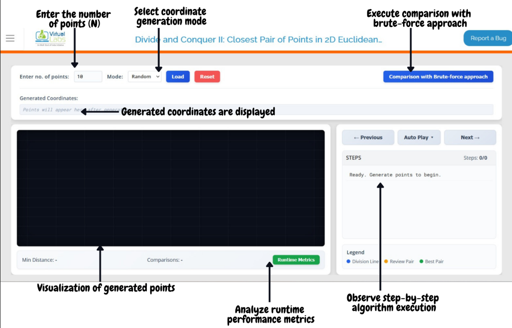
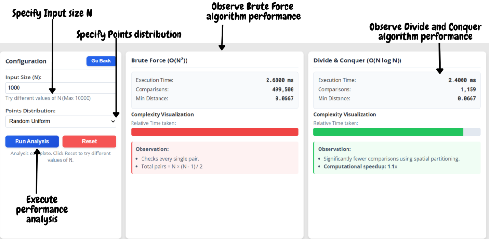

### Procedure

1. Open the **Closest Pair of Points – Divide & Conquer Simulation** experiment.

2. Enter the desired number of points **N** in the input field **"Enter no. of points"**.  

   **Input Constraint:** The experiment allows values in the range **2 < N ≤ 20**.  
   If a value outside this range is entered, the system prompts the user to select a valid input.

3. Select the input mode from the **Mode** dropdown:  

   **Random** → Points are generated randomly by the system  
   **Manual** → Points are entered manually by the user  

---

### Random Mode (Random Generation)

4. Select **Mode = Random**.

5. Click the **Load** button.

6. Randomly generated 2D coordinate points are displayed in the **Generated Coordinates** panel.

7. The same points are plotted on the visualization canvas with labeled indices.

---

### Manual Mode (User Input)

8. Select **Mode = Manual**.

9. A text input field appears inside the **Generated Coordinates** panel. Enter the coordinates manually in the format:  

   x1,y1  x2,y2  x3,y3 ...  

   **Example:**  
   10,20 30,40 50,60  

10. Click the **Load** button.

11. The manually entered points are validated, displayed in the **Generated Coordinates** panel, and plotted on the canvas.

---

### Simulation Execution

12. Once the points are loaded, the navigation controls become active on the right panel.

13. Click the **Auto Play ▾** button to begin the simulation automatically.

14. Select the execution speed (**Slow / Normal / Fast**) from the speed dropdown that appears below **Auto Play**.

15. Alternatively, use the **Next →** button to execute the algorithm step-by-step manually.

16. Use the **← Previous** button to revisit earlier steps and analyze recursive divisions and comparisons.

17. During execution, observe the following steps in the **Steps** panel on the right:

   - Sorting of points based on X-coordinates  
   - Recursive division of the point set into left and right halves  
   - Drawing of the Division Line  
   - Formation of the Strip Region near the dividing line  
   - Comparison of point pairs inside the strip  
   - Continuous updates to the current minimum distance (δ)

18. The step counter at the top of the Steps panel shows the current step number (e.g., **Steps: 5/32**), allowing you to track your progress through the algorithm.

---

### Visualization Details

19. Observe the following visual indicators on the canvas during execution:

   - **Blue dashed line** → Division Line that splits the point set into left and right halves  
   - **Orange connecting line** → The pair of points currently being compared  
   - **Green connecting line** → The best (closest) pair found so far  
   - **Labeled points** → Each point is displayed with its index for easy identification  

20. The **Legend** panel at the bottom-right provides a quick reference to these color indicators:
   - 🔵 Division Line  
   - 🟠 Review Pair  
   - 🟢 Best Pair  

  

---

### Facts & Analysis (Runtime Metrics)

21. Monitor real-time metrics displayed in the **stats bar** below the canvas:

   - **Min Distance** → The current minimum distance (δ) found so far  
   - **Comparisons** → The total number of distance comparisons performed  

22. Click the **Runtime Metrics** button (in the stats bar) to open a detailed modal showing:

   - **Total Comparisons (D&C)** – Number of comparisons made by the Divide & Conquer algorithm  
   - **Total Comparisons (Brute Force)** – Number of comparisons a brute force approach would require (N×(N-1)/2)  
   - **Comparisons Saved** – The difference, showing how many comparisons were avoided  
   - **Execution Time** – The time taken by the D&C algorithm to find the closest pair  

---

### Comparison with Brute-Force Approach

**Objective of this section:**  
The objective of this section of the lab is to provide a nuanced comparison of how the Divide and Conquer strategy leads to significant improvements that become clearer as the input size increases. A comparison of both approaches is presented from the perspectives of execution time and number of comparisons made. Observe that the optimal minimum distance is obtained in both approaches, but the Divide and Conquer method achieves this result much more efficiently — with significantly fewer comparisons and faster execution time.

  

23. Click the **Comparison with Brute-Force approach** button (located in the top configuration bar).

24. A new comparison view opens with its own **Configuration** panel:

   - Enter the input size (**N**) for scalability analysis (max 10,000)  
   - Select the point distribution:
     - **Random Uniform** → Points distributed uniformly at random
     - **Worst Case (Collinear)** → All points lie on a straight line
     - **Best Case (Clusters)** → Points form well-separated clusters

25. Click the **Run Analysis** button.

26. Observe and compare the results for both approaches side-by-side:

   - **Execution Time** for Brute Force vs. Divide & Conquer  
   - **Number of Distance Computations** for each approach  
   - **Minimum Distance** found (should be identical for both)  
   - **Complexity Visualization** – relative time bars showing the performance difference  
   - **Computational speedup** achieved using Divide & Conquer (displayed as Nx)  
   - **Observations** – automatically generated insights for each approach  

27. Click the **Reset** button to clear the comparison results and try different configurations.

28. Click the **Go Back** button to return to the main simulation view.

29. On the main simulation view, click the **Reset** button to clear the experiment and perform a new simulation.

